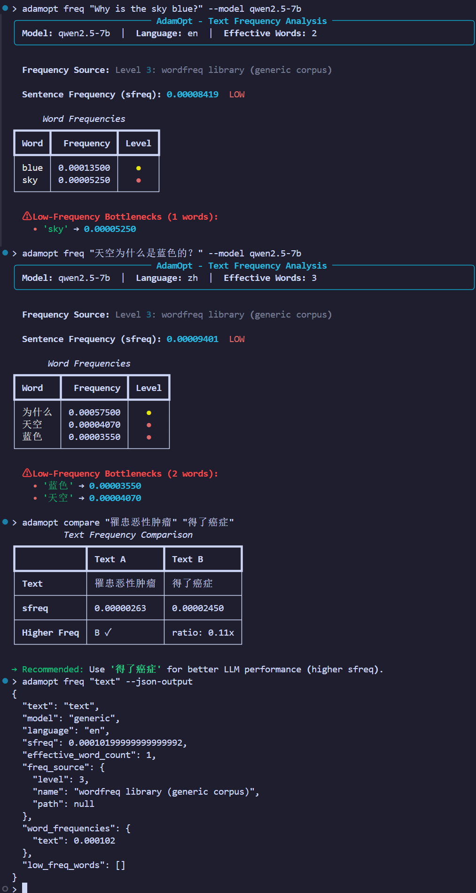
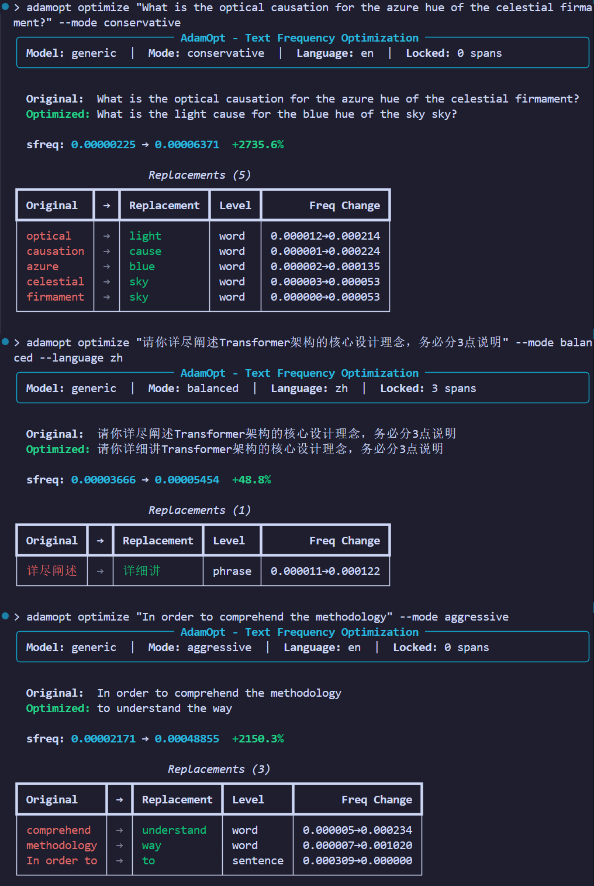

<p align="center">
  <h1 align="center">AdamOpt</h1>
  <p align="center">
    <b>Automatic text frequency optimization for LLMs based on Adam's Law</b>
    <br/>
    <i>Turn "Prompt Alchemy" into science. Boost LLM performance 10-20% with zero cost and zero training.</i>
  </p>
</p>

<p align="center">
  <a href="https://opensource.org/licenses/MIT"></a>
  <a href="https://www.python.org/downloads/"></a>
  <a href="#"></a>
</p>

---

## Why AdamOpt?

**Adam's Law** (Textual Frequency Law, 2026) proves that when two texts mean the same thing, the one using **higher-frequency words** consistently gets **better results** from LLMs — across all tasks, all models, all languages.

| Before (low frequency) | After (high frequency) | sfreq Improvement |
|------------------------|----------------------|-------------------|
| *"What is the optical causation for the azure hue of the celestial firmament?"* | *"What is the light cause for the blue hue of the sky?"* | **+2735%** |
| *"请你详尽阐述Transformer架构的核心设计理念"* | *"请你详细讲Transformer架构的核心设计理念"* | **+48.8%** |
| *"In order to comprehend the methodology"* | *"to understand the way"* | **+2150%** |

AdamOpt automates this — one command to analyze, optimize, and verify.

## Features

- **Text Frequency Analysis** — Quantify how "common" any text is to an LLM using the sfreq formula
- **Three-Tier Optimization** — Conservative (word-level), Balanced (word+phrase), Aggressive (full rewrite)
- **Semantic Fidelity Protection** — Automatically locks entities, numbers, logic keywords, instructions — never breaks meaning
- **Chinese & English** — Full bilingual support with language auto-detection
- **Model-Aware** — Supports Qwen, Llama, DeepSeek, and custom models via TFD (Textual Frequency Distillation)
- **Zero Dependencies on LLM APIs** — Works entirely offline with built-in synonym tables

## Quick Start

```bash
pip install adamopt
```

Or from source:

```bash
git clone https://github.com/happyii/adamopt.git
cd adamopt && pip install -e .
```

### Optimize a Prompt (one command)

```bash
# Balanced mode (recommended for most use cases)
adamopt optimize "What is the optical causation for the azure hue of the celestial firmament?" --mode balanced

# Chinese text optimization
adamopt optimize "请你详尽阐述Transformer架构的核心设计理念，务必分3点说明" --mode balanced --language zh

# Conservative mode (safest, word-level only)
adamopt optimize "We need to utilize this methodology" --mode conservative

# Aggressive mode (maximum frequency boost)
adamopt optimize "In order to comprehend the methodology" --mode aggressive
```

### Analyze Text Frequency

```bash
adamopt freq "Why is the sky blue?" --model qwen2.5-7b
adamopt compare "罹患恶性肿瘤" "得了癌症"
```

## Demo

### Module 1: Text Frequency Analysis

<p align="center">
  
</p>

### Module 2: Text Frequency Optimization

<p align="center">
  
</p>

## Python API

```python
from adamopt import FrequencyEstimator, TextOptimizer

# Analyze frequency
estimator = FrequencyEstimator(model="qwen2.5-7b")
result = estimator.estimate("Why is the sky blue?")
print(result.sfreq)          # 0.000084
print(result.freq_source)    # [Level 3] wordfreq library

# Optimize text
optimizer = TextOptimizer(model="qwen2.5-7b")
result = optimizer.optimize(
    "What is the optical causation for the azure hue of the celestial firmament?",
    mode="balanced",
)
print(result.optimized_text)  # Higher-frequency version
print(result.sfreq_ratio)    # e.g., 28.35x improvement
```

## How It Works

AdamOpt is built on a simple but powerful insight from Adam's Law:

$$\text{sfreq}(x) = \left(\prod_{k=1}^{K} \text{wfreq}(x_k)\right)^{1/K}$$

**Higher sfreq → Lower perplexity → Better LLM performance**

The optimization pipeline:

```
Input Text → Lock Protected Content → Find Low-Freq Bottlenecks → Replace with High-Freq Synonyms → Restore Locked Content → Output
```

### Three Optimization Modes

| Mode | What it does | Semantic Fidelity | Best for |
|------|-------------|-------------------|----------|
| `conservative` | Word-level synonym replacement only | ≥99% | Legal, medical, professional tasks |
| `balanced` | Word + phrase-level paraphrase | ≥95% | Most use cases (default) |
| `aggressive` | Word + phrase + sentence rewrite | ≥90% | Simple Q&A, casual generation |

### What Gets Protected (never modified)

| Category | Examples |
|----------|---------|
| Core entities | `Transformer`, `GPT-4o`, `浙江大学` |
| Instruction words | `translate`, `summarize`, `翻译` |
| Logic keywords | `not`, `must`, `if...then`, `不`, `必须` |
| Numbers & formulas | `95%`, `x+y=z`, `2026年4月` |
| Format constraints | `in JSON format`, `不超过300字` |
| Code | `` `pip install` ``, URLs, emails |

## Supported Models

| Model | Family | Languages |
|-------|--------|-----------|
| Qwen2.5 (0.5B ~ 72B) | qwen2.5 | en, zh |
| Llama3.3 (8B, 70B) | llama3.3 | en |
| DeepSeek-V3 | deepseek | en, zh |
| Generic | generic | en, zh |

> Use `generic` for unlisted models, or run `adamopt tfd` to build a model-specific frequency table via Textual Frequency Distillation (TFD).

## Advanced: TFD (Textual Frequency Distillation)

For model-specific frequency optimization (especially for closed-source models):

```bash
# 1. Generate continuations from your target LLM (save as text file)
# 2. Run TFD to build a model-specific frequency table
adamopt tfd continuations.txt --model qwen2.5-7b

# 3. All subsequent commands automatically use the enhanced table
adamopt optimize "your prompt" --model qwen2.5-7b
```

## Roadmap & Call for Contributors

AdamOpt is at an early stage — the core foundation is solid, and we need the community to help build it into a production-grade tool. Below are the modules we've planned. **Contributions to any of them are highly welcome!**

| Module | Status | Description | Why It Matters |
|--------|--------|-------------|----------------|
| **Module 1: Frequency Estimation** | ✅ Done | Compute word-level (wfreq) and sentence-level (sfreq) frequency for any text, with TFD distillation for model-specific tables | The measurement foundation — you can't optimize what you can't measure |
| **Module 2: Frequency Optimization** | ✅ Done | Three-tier optimization (conservative/balanced/aggressive) with semantic content locking | The core value — one command to boost prompt/data performance |
| **Module 3: Semantic Fidelity Verification** | 🔜 Planned | Dual-check system: embedding similarity (BGE-M3) + LLM binary classification, with auto-fallback on failure | The safety net — ensures optimization never breaks meaning. Critical for user trust |
| **Module 4: Batch Fine-tuning Data Processing** | 🔜 Planned | JSONL batch optimization with multi-threading, checkpoint resume, and CTFT auto-sorting (low→high frequency training order) | The killer feature for ML engineers — optimize entire training datasets, not just single prompts |
| **Module 5: API & Web Interface** | 🔜 Planned | RESTful API (FastAPI, OpenAI-compatible) + Gradio Web Demo | Makes AdamOpt accessible to non-CLI users and integrable into existing pipelines |

### How You Can Help

- **Module 3** needs someone familiar with sentence embeddings (BGE-M3 / sentence-transformers) — [see issue #TBD]
- **Module 4** needs streaming JSONL processing and multi-threaded optimization — great for systems engineers
- **Module 5** is a straightforward FastAPI + Gradio build — perfect first contribution
- **Synonym tables** — help us expand the built-in Chinese/English synonym dictionaries
- **Language support** — add stopwords and synonym tables for Japanese, Korean, French, German, etc.
- **Bug reports & feature requests** — every issue helps

## Reference

This project is inspired by and built upon the following research:

> **Adam's Law: Textual Frequency Law on Large Language Models**
>
> Hongyuan Adam Lu, Z. L., Victor Wei, Zefan Zhang, Zhao Hong, Qiqi Xiang, Bowen Cao, Wai Lam
>
> *"Semantically equivalent texts with higher frequency in LLM pretraining distributions consistently achieve better performance across all tasks, models, and languages."*

- **Paper**: [Adam's Law: Textual Frequency Law on Large Language Models](https://arxiv.org/abs/2604.02176)
- **Official Code**: [github.com/HongyuanLuke/frequencylaw](https://github.com/HongyuanLuke/frequencylaw)


## Contributing

We'd love your help! See [CONTRIBUTING.md](CONTRIBUTING.md) for the full guide.

```bash
git clone https://github.com/happyii/adamopt.git
cd adamopt && pip install -e ".[dev]"
pytest tests/ -v  # 85 tests, all passing
```

Whether it's a typo fix, a new synonym entry, or an entire module — **every contribution counts**. Let's make prompt optimization a solved problem together.

## License

[MIT](LICENSE) — use it freely in commercial and non-commercial projects.
